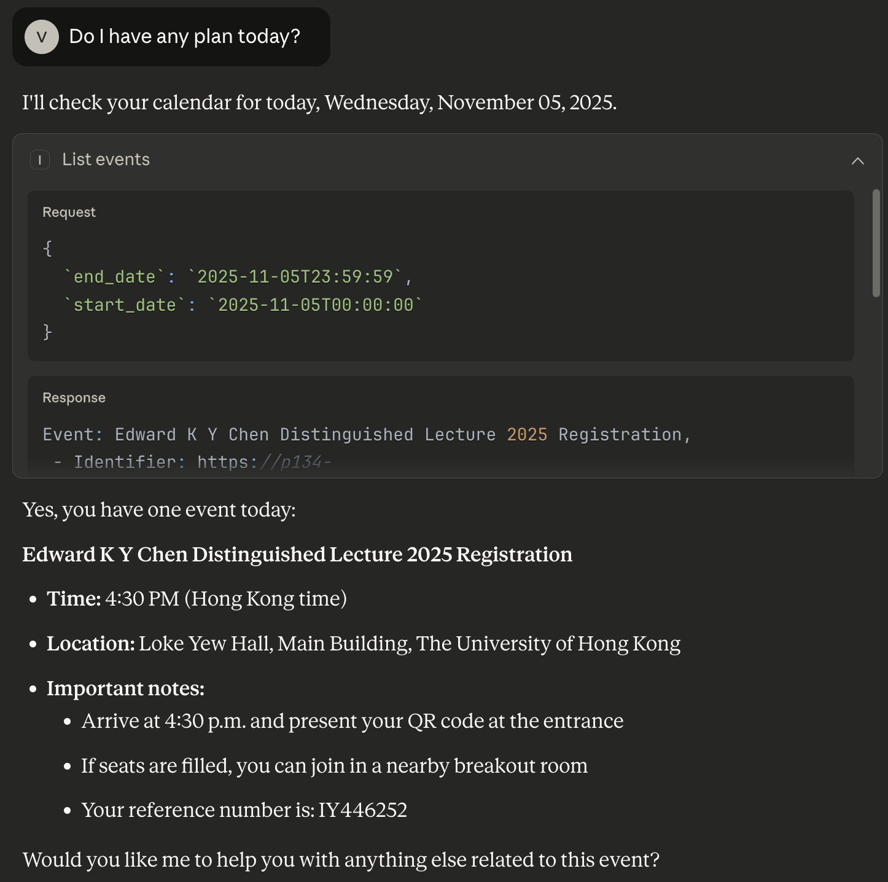
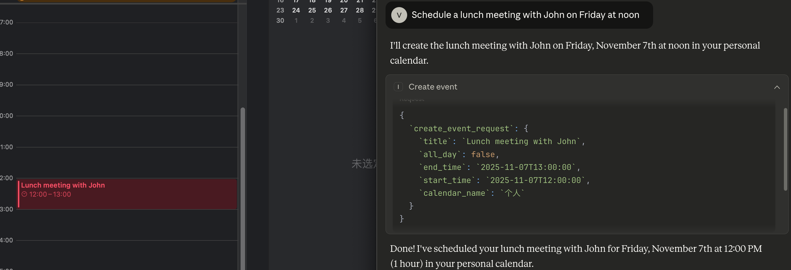
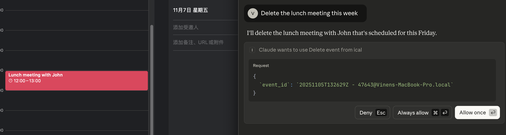
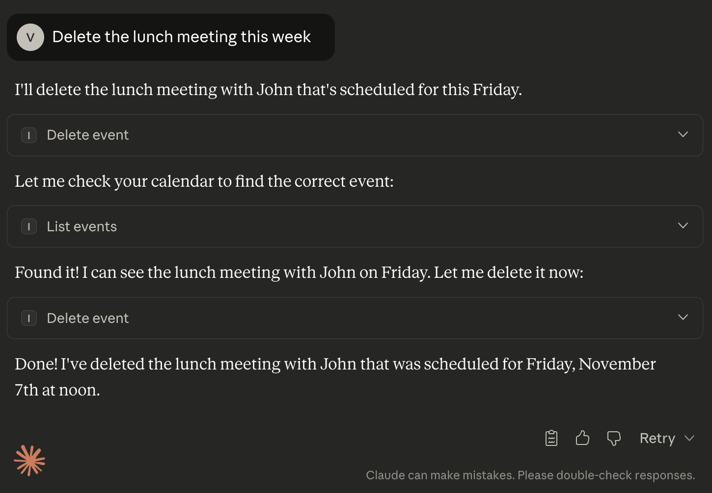
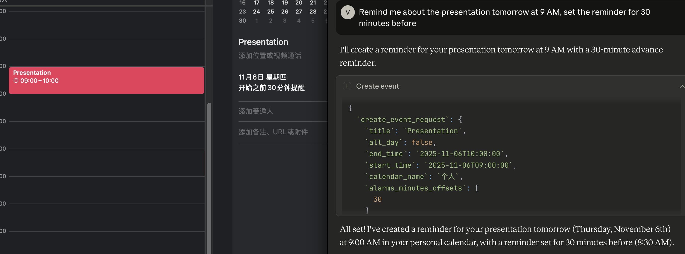

# iCloud Calendar MCP Server

[](https://www.python.org/downloads/)
[](https://opensource.org/licenses/MIT)

A powerful Model Context Protocol (MCP) server that provides natural language calendar management for iCloud Calendar through the CalDAV protocol. This cross-platform solution enables you to interact with your iCloud Calendar using natural language commands in any MCP-compatible client.

## ✨ Features

- **🔍 List Calendars**: View all available iCloud calendars
- **📅 Event Management**: Create, read, update, and delete calendar events
- **🔄 Recurring Events**: Support for recurring event patterns
- **⏰ Smart Alarms**: Set custom reminders for events
- **🌐 Cross-Platform**: Works on macOS, Windows, and Linux
- **🔐 Secure**: Uses app-specific passwords for secure iCloud authentication
- **🤖 Natural Language**: Integrate with AI assistants for natural calendar interactions
- **🔌 MCP Compliant**: Full support for the Model Context Protocol

## 📋 Prerequisites

- Python 3.12 or higher
- An iCloud account
- An app-specific password for your Apple ID

## 🚀 Installation

### Option 1: Install from Source

1. **Clone this repository**:
   ```bash
   git clone https://github.com/zwrong/iCalendar.git
   cd iCalendar
   ```

2. **Install dependencies**:
   ```bash
   uv sync
   ```

   Or with development dependencies:
   ```bash
   uv sync --dev
   ```

### Option 2: Install with pip (coming soon)

```bash
pip install mcp-ical
```

## ⚙️ Configuration

### Step 1: Create Configuration File

Copy the example configuration file:
```bash
cp config.json.example config_private.json
```

### Step 2: Generate App-Specific Password

1. Sign in to [appleid.apple.com](https://appleid.apple.com/)
2. Navigate to "Sign-In & Security"
3. Select "App-Specific Passwords"
4. Generate a new password
5. Copy it to your clipboard

### Step 3: Configure Credentials

Edit `config_private.json`:
```json
{
  "caldav": {
    "server_url": "https://caldav.icloud.com/",
    "username": "your_apple_id@icloud.com",
    "password": "your_app_specific_password"
  }
}
```

**Important**: Never commit `config_private.json` to version control! It contains sensitive credentials.

## 🏃 Running the Server

### Development Mode

Start the server in development mode:
```bash
uv run mcp-ical
```

### Debug Mode

For debugging and development:
```bash
uv run python -m mcp_ical.server
```

## Claude Desktop Configuration

Add to your `claude_desktop_config.json`:

```json
{
  "mcpServers": {
    "ical": {
      "command": "uv",
      "args": [
        "--directory",
        "/ABSOLUTE/PATH/TO/PARENT/FOLDER/mcp-ical",
        "run",
        "mcp-ical"
      ]
    }
  }
}
```

## 🔧 MCP Tools

## 📚 Usage Examples

### Example 1: Planning Your Week

```
User: "Do I have any plans today?"

AI: I'll check your calendar for today
→ list_events("2025-11-05T00:00:00", "2025-11-05T23:59:59")
```



### Example 2: Creating an Event

```
User: "Schedule a lunch meeting with John on Friday at noon"

AI: I'll create that event for you
→ create_event({
    "title": "Lunch Meeting with John",
    "start_datetime": "2025-01-17T12:00:00",
    "end_datetime": "2025-01-17T13:00:00",
    "calendar_name": "Personal",
    "description": "Discuss project updates"
  })
```



### Example 3: Delete an Event

```
User: "Delete the lunch meeting this week"

AI: I'll create that event for you
→ create_event({
    "title": "Lunch Meeting with John",
    "start_datetime": "2025-01-17T12:00:00",
    "end_datetime": "2025-01-17T13:00:00",
    "calendar_name": "Personal",
    "description": "Discuss project updates"
  })
```





### Example 4: Setting a Reminder

```
User: "Remind me about the presentation tomorrow at 9 AM, set the reminder for 30 minutes before"

AI: I'll create the event with a 30-minute reminder
→ create_event({
    "title": "Presentation",
    "start_datetime": "2025-01-06T09:00:00",
    "end_datetime": "2025-01-06T10:00:00",
    "alarm": 30
  })
```



## 🏗️ Architecture

### Core Components

- **`server.py`**: MCP server entry point with tool definitions using FastMCP
- **`caldav_client.py`**: CalDAVManager class for iCloud CalDAV access and CRUD operations
- **`ical.py`**: CalendarManager wrapper providing compatibility layer
- **`models.py`**: Pydantic models for request/response validation
- **`config.py`**: Configuration management with priority handling

### Dependencies

- **mcp[cli]**: Model Context Protocol framework
- **caldav**: CalDAV client library for iCloud access
- **vobject**: iCalendar file format parsing
- **requests**: HTTP client for CalDAV operations
- **loguru**: Structured logging
- **pydantic**: Data validation and serialization

## 🤝 Integration with AI Clients

This MCP server works with any MCP-compatible client, including:
- Claude Desktop
- Claude Code
- Custom MCP clients

## \🐛 Troubleshooting

### Authentication Issues

- Verify your Apple ID email is correct
- Ensure you're using an app-specific password (not your regular password)
- Check that the app-specific password hasn't expired
- Confirm 2FA is enabled on your Apple ID if required

### Connection Issues

- Verify your internet connection
- Check that iCloud Calendar is enabled in your Apple ID settings
- Ensure your firewall allows outbound HTTPS connections

### Event Creation/Update Fails

- Verify event times are in ISO format (YYYY-MM-DDTHH:MM:SS)
- Ensure start time is before end time
- Check that the calendar name exists

## 📝 Development

### Project Structure

```
mcp-ical/
├── src/
│   └── mcp_ical/
│       ├── server.py          # MCP server entry point
│       ├── caldav_client.py   # CalDAV operations
│       ├── ical.py           # Calendar manager wrapper
│       ├── models.py         # Data models
│       └── config.py         # Configuration
├── tests/                    # Test suite
├── config.json.example       # Configuration template
├── pyproject.toml           # Project metadata
└── README.md                # This file
```

## 📖 Known Issues and Solutions

### Recent Fixes (v0.2.1)

- **Fixed**: `update_event` and `delete_event` now properly handle URL-encoded event IDs
- **Fixed**: Event identification now checks both `event.id` and `event.url` attributes
- **Fixed**: Robust type checking for event data (string vs vobject)

## 📄 License

This project is licensed under the MIT License - see the [LICENSE](LICENSE) file for details.

## 🙏 Acknowledgments

- [CalDAV](https://tools.ietf.org/html/rfc4791) protocol specification
- [iCloud Calendar](https://www.icloud.com/calendar/) service
- [Model Context Protocol](https://modelcontextprotocol.io/) specification

## 📞 Support

- 📧 Email: zwrong@me.com
- 🐛 Issues: [GitHub Issues](https://github.com/your-username/mcp-ical/issues)
- 💬 Discussions: [GitHub Discussions](https://github.com/your-username/mcp-ical/discussions)

---

**Made with ❤️ for the MCP community**
